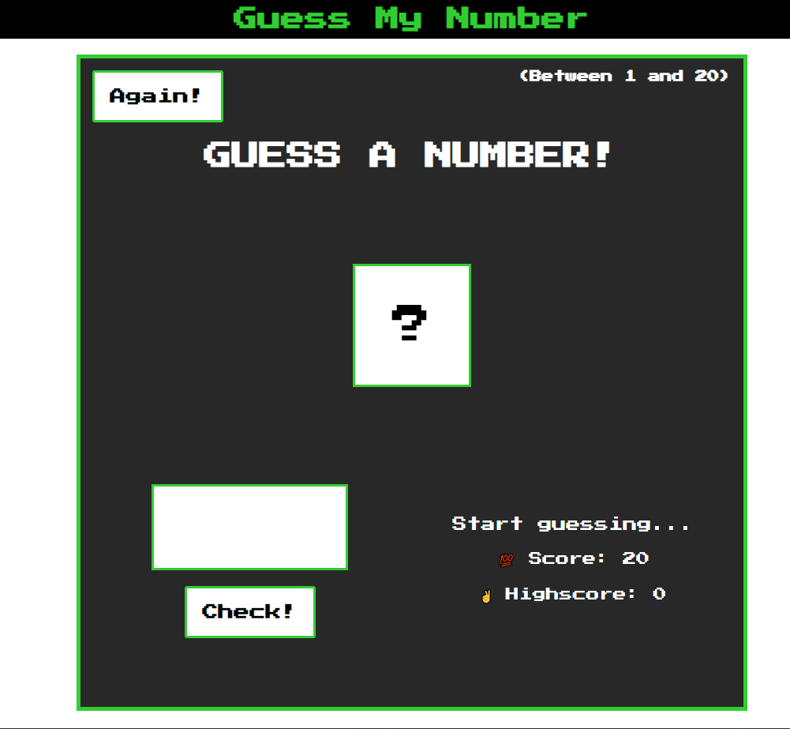

# TABLE OF CONTENTS

[Project Title](#project-title)
[Description](#description)
[Installation](#installation)
[Usage](#usage)
[Guidelines](#guidelines)
[Testing the Application](#testing-the-application)
[Github](#github)
[Contact Us](#contact-us)
[Licence](#licence)

## Project Title

Guess My Number

## Description

This project is a coding exercise titled Pig Game from Jonas Schmedtmann's course - The Complete Javascript Course: Zero to Mastery, which can be found on Udemy: https://www.udemy.com/course/the-complete-javascript-course/

## Installation

Not Required

## Usage

The game interface is simple.

## Guidelines

I have included my own css styles but you can style it however you like for your own copy.

## Testing the Application

## Github

https://github.com/Sho-ayb/guess-my-number

## Deployed Live

[Guess My Number](https://sho-ayb.github.io/guess-my-number/)

## Game Snapshots

## Licence

MIT License

Please click on the badge for more details on the licence.

